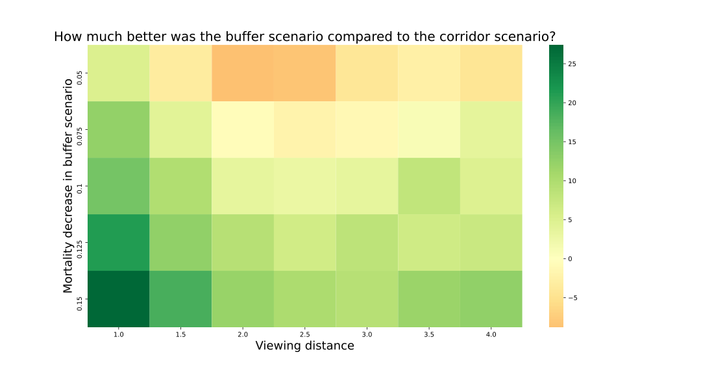
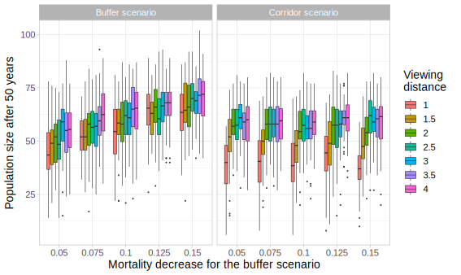

# Experiment 

Output after 50 years in both scenarios:

- total newts
- number of occupied ponds
- newts in pond 1

Varied parameter:

- mortality decrease in buffer scenario: 0.05 - 0.15 with 0.025 interval

- viewing distance: 1 - 4 with 0.5 interval 

  

Fixed parameter:

- capacity per pond: 20
- juvenile mortality: 0.5
- adult mortality: 0.2
- start population size: 15
- cropland movement cost: 5
- woodland movement cost: 1
- viewing angle: 140°
- movement energy: 700
- mean number of offspring: 5 

