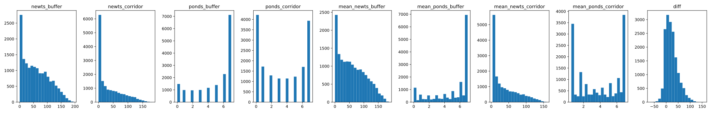
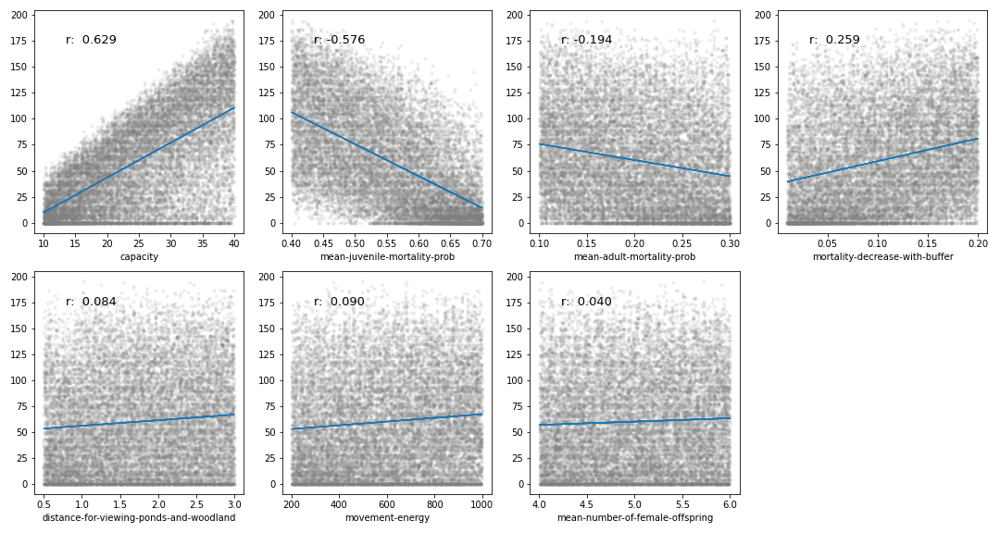
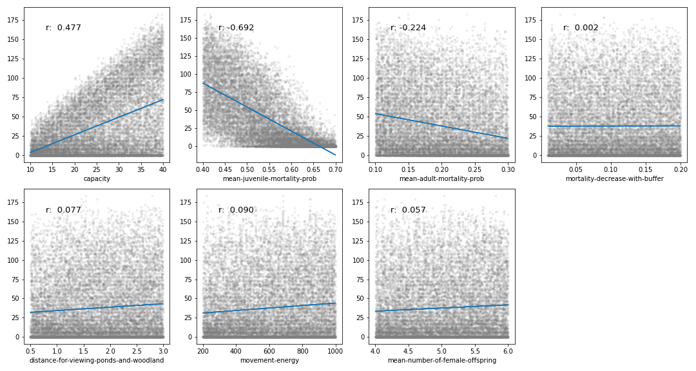
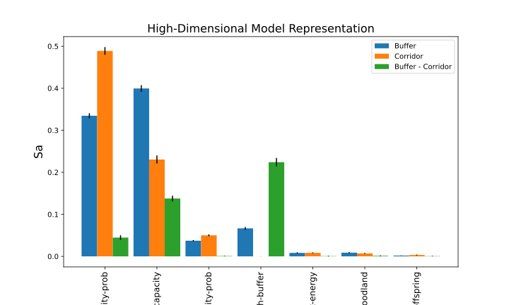
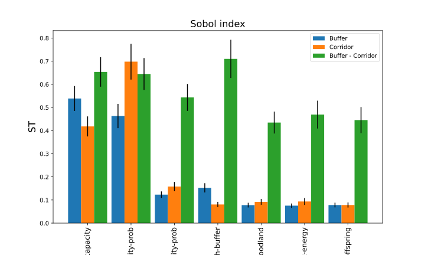
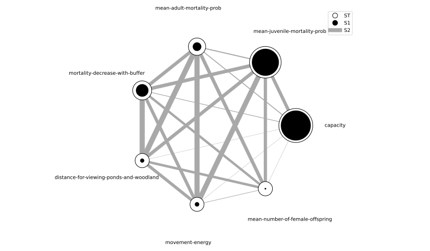
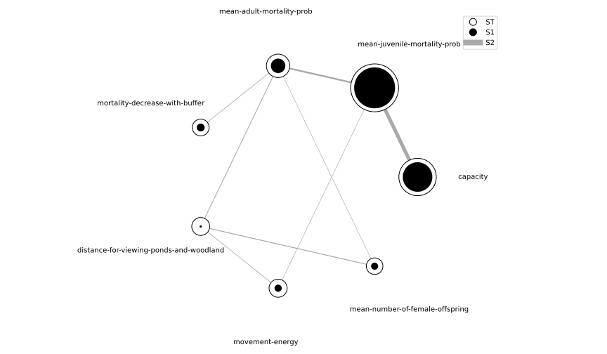

# Sobol Sensitivity Analysis

Fixed parameter:

- start population size: 40

- cropland movement cost: 5

- woodland movement cost: 1

- viewing angle: 140°

Parameter ranges of 7 parameter:

- capacity per pond: 10 - 40

- juvenile mortality: 0.3 - 0.7

- adult mortality: 0.1 - 0.3

- mortality decrease in buffer scenario: 0.001 - 0.2

- viewing distance: 0.5 - 3

- movement energy: 200 - 1000

- mean number of offspring: 4 - 6 

  

  &#8594;Parameter values were generated with  Saltelli’s extension of the Sobol’ sequence 

  ​	N = 1024 with second_order=True

  ​	total runs = N * (2*D +2) = 16348 runs

Output after 50 years of both scenarios:

- total newts
- number of occupied ponds

 Sensitivity analysis methods (separate for each out variable):

- Correlation of parameters along output variables
- High-Dimensional Model Representation (HDMR) using B-spline functions
- Sobol Analysis

Buffer:

Corridor:

Buffer:

Corridor:

